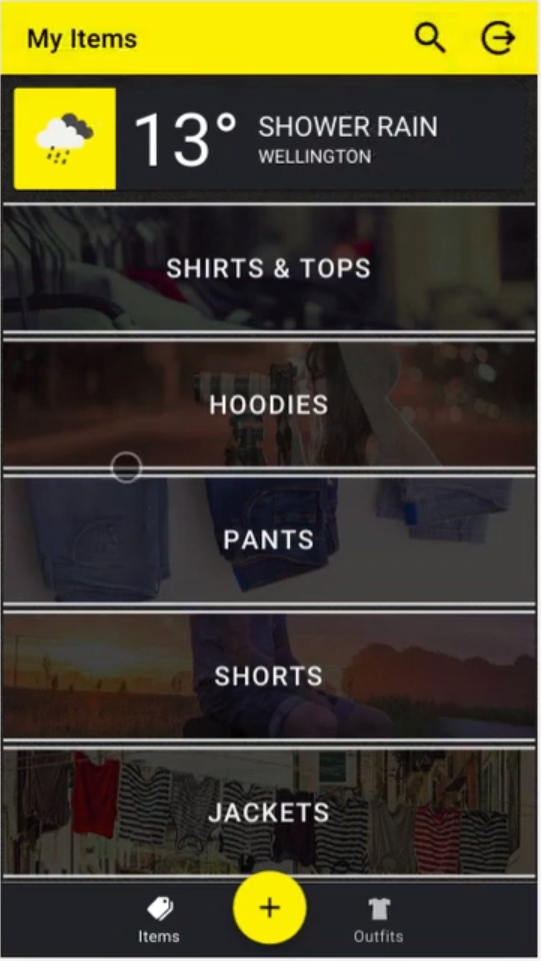
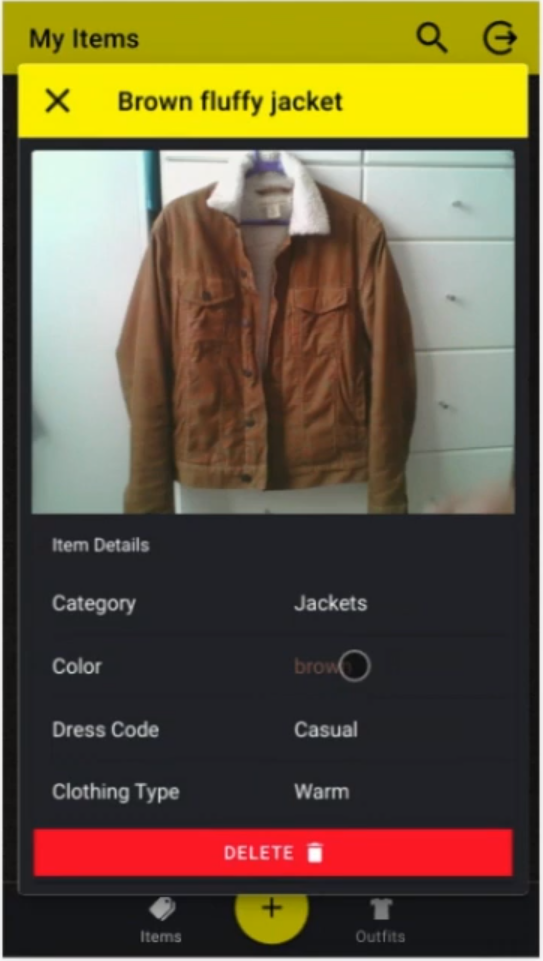

# Outfitter App by Tariq Saiyad

#### This app is built using the Ionic Framework

**[Link to demo video](https://youtu.be/H3AIHTpFEqw)**

|  
        

#### Notes:

- to run the app, first install the node modules using `npm install`
- then run `ionic serve` to start the app
- use F12 to run it in mobile mode using Chrome Dev Tools
- **Note**: the Speech recognition API is only avaiable on Chrome

---

